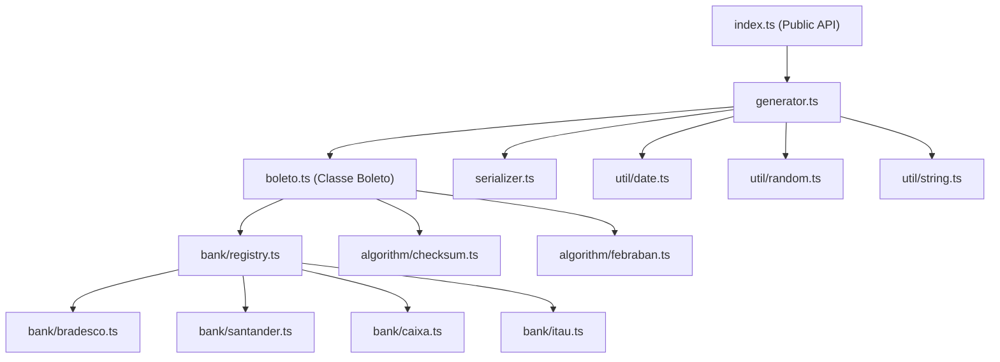

# Arquitetura de Projeto — @box4dev/gerador-boleto

## Propósito

Biblioteca NPM para **geração de boletos bancários** (linha digitável e código de barras) seguindo o padrão **FEBRABAN**. Suporta 4 bancos: **Bradesco**, **Santander**, **Caixa** e **Itaú**.

## Arquitetura

## Funcionalidades Principais

| Funcionalidade      | Descrição                                                                |
| ------------------- | ------------------------------------------------------------------------ |
| Geração vazia       | `gerarBoleto()` — todos os campos aleatórios                             |
| Geração parcial     | `gerarBoleto({banco: 'bradesco'})` — preenche restante aleatoriamente    |
| Geração completa    | `gerarBoleto({...todos os campos})` — dados fixos, output determinístico |
| Campos customizados | Preserva campos extras no output JSON (metadados)                        |
| Suporte a datas     | Aceita `Date`, ISO string, e formato `DD/MM/YYYY`                        |
| FEBRABAN v2         | Nova regra de fator de vencimento (reinício em 22/02/2025)               |

## Bancos Suportados

| Banco     | Código | Carteiras                   | NN Dígitos |
| --------- | ------ | --------------------------- | ---------- |
| Bradesco  | 237    | 9, 4, 6, 21, 22, 25, 26, 19 | 11         |
| Santander | 033    | 101, 102, 201, 104          | 12         |
| Caixa     | 104    | 14, 24, 2, 1, 11, 82        | 15-17      |
| Itaú      | 341    | 104, 109, 112, 175          | 8          |
